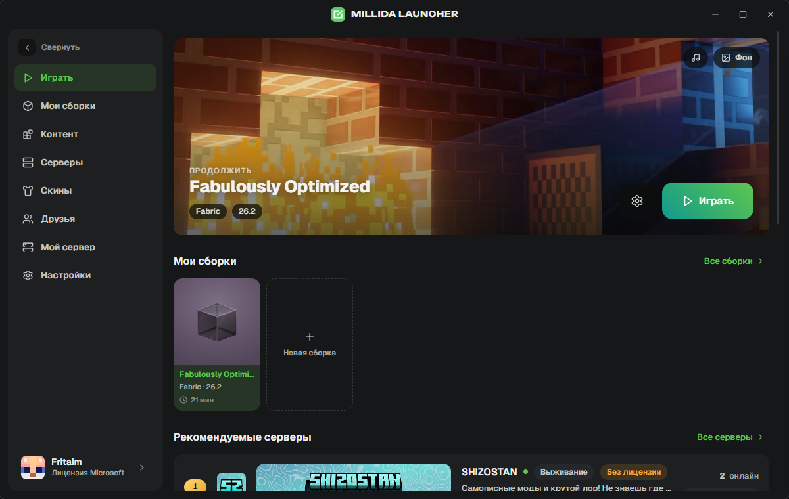
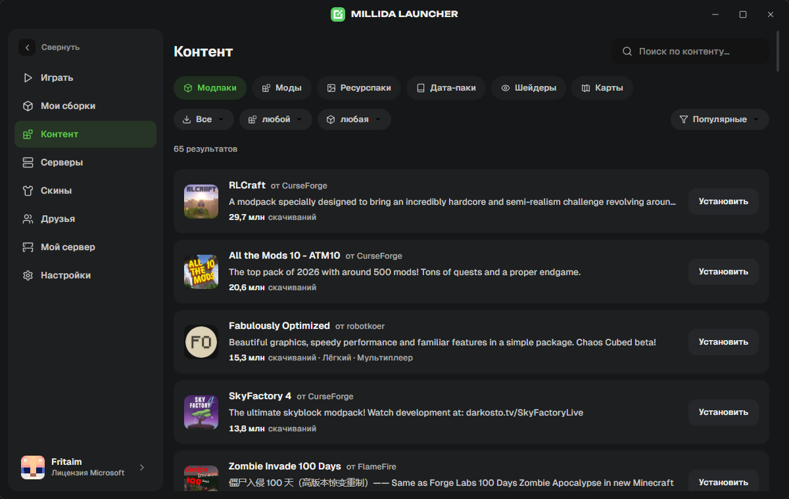
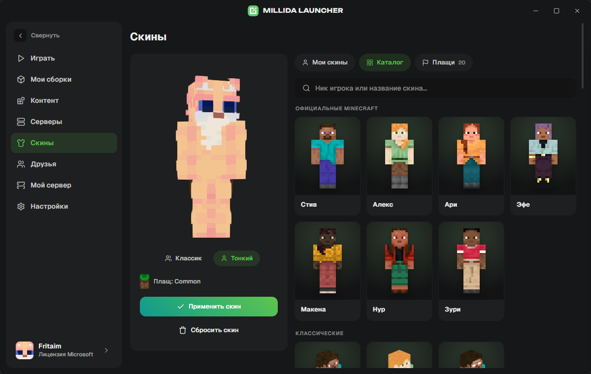
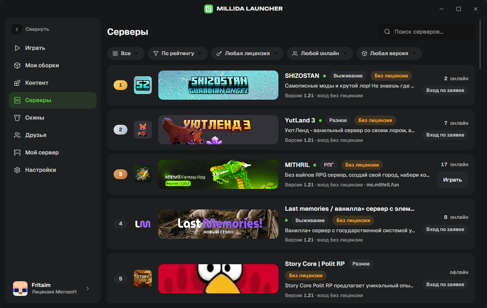
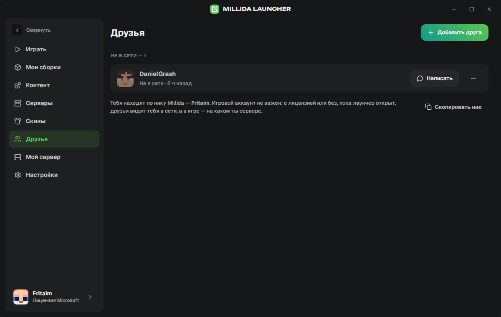
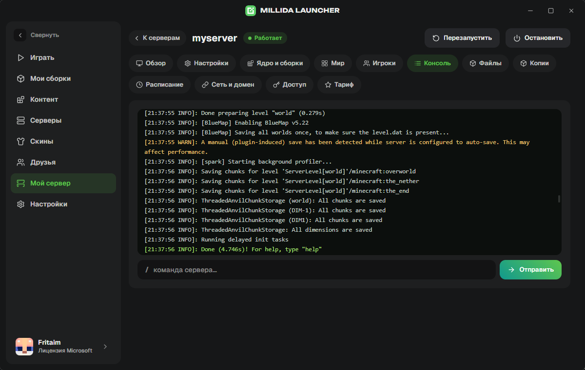

# Millida Launcher

Лаунчер Minecraft для Windows, macOS и Linux. Любая версия игры, моды и модпаки
в один клик, свои сборки, скины, друзья и серверы — в одном окне. Бесплатно,
без рекламы, Java ставить отдельно не нужно.



## Скачать

Страница загрузки со всеми файлами: **[millida.net/launcher](https://millida.net/launcher)**

| Система | Прямая ссылка | Что скачается |
| --- | --- | --- |
| Windows 10 / 11 (64 бита) | [Скачать для Windows](https://millida.net/launcher/dl/windows) | Установщик `.exe` (есть и `.msi`) |
| macOS (Apple Silicon и Intel) | [Скачать для macOS](https://millida.net/launcher/dl/macos) | Образ `.dmg` под свой процессор |
| Linux x86-64 | [Скачать для Linux](https://millida.net/launcher/dl/linux) | Flatpak (есть `.AppImage`, `.deb`, `.rpm`) |

### Windows

1. Скачай установщик и запусти его.
2. Если появится синее окно «Windows защитила ваш компьютер» — нажми
   **«Подробнее»** → **«Выполнить в любом случае»**. Так Windows встречает
   программы без купленного сертификата издателя; сертификат мы оформляем,
   а каждая сборка до публикации проверяется антивирусом — отчёт лежит в
   разделе [«Безопасность»](https://millida.net/launcher#safety) на сайте.
3. Дальше «Далее» — и лаунчер откроется сам. Ярлык появится в меню «Пуск».

Обновления лаунчер ставит сам: скачивает в фоне и применяет при закрытии окна.

### macOS

1. Открой скачанный `.dmg` и перетащи **Millida Launcher** в папку
   **«Программы»**.
2. Если система пишет, что приложение «повреждено» — с файлом всё в порядке,
   так macOS сообщает, что подпись Apple Developer ещё не оформлена. Выполни
   один раз в Терминале:

   ```bash
   chmod -R u+w "/Applications/Millida Launcher.app" && xattr -cr "/Applications/Millida Launcher.app"
   ```

   Либо: «Системные настройки» → «Конфиденциальность и безопасность» →
   **«Всё равно открыть»** после первой попытки запуска.
3. Запусти лаунчер из «Программ».

Для Apple Silicon (M1–M4) и Intel — отдельные сборки, ссылка выше выбирает
нужную сама.

### Linux

Основной способ — Flatpak: ставится и обновляется одинаково на Ubuntu, Fedora,
Arch, Silverblue, Bazzite и SteamOS.

```bash
flatpak install --user https://launcher-flatpak.millida.net/millida-launcher.flatpakref
```

Скачанный `.flatpakref` можно просто открыть двойным кликом — GNOME Software и
Discover поставят приложение сами. Нужны `.AppImage`, `.deb` или `.rpm` — они
под кнопкой «Другие варианты» на [странице загрузки](https://millida.net/launcher#download).

### Что нужно для игры

- 64-битная система: Windows 10/11, macOS 11+, Linux x86-64.
- Интернет для первой установки версии игры.
- Java ставить не нужно — лаунчер сам скачает подходящую.
- Аккаунт Minecraft необязателен: можно играть по нику. Есть лицензия — вход
  по обычной кнопке Microsoft, пароль лаунчер не спрашивает.

## Что внутри

**Играть сразу.** Выбираешь версию — от свежего релиза до старых и снапшотов —
и жмёшь «Играть». Игра, библиотеки и Java скачиваются сами.

**Моды и модпаки без архиватора.** Встроенный каталог Modrinth и CurseForge:
модпаки, моды, шейдеры, ресурспаки, карты и датапаки. Кнопка «Установить» кладёт
файл в нужную сборку и подтягивает зависимости, а обновления показываются
списком — можно обновить всё разом или откатиться назад.



**Свои сборки.** Каждая сборка — отдельная папка игры со своими модами,
настройками и памятью. Сборки можно дублировать, объединять в группы, ставить
обложки и чинить, если что-то сломалось.

**Скины и плащи.** Библиотека скинов, каталог, предпросмотр в 3D и смена скина
прямо из лаунчера — на лицензии и на серверах Millida.



**Серверы.** Каталог серверов с рейтингом, онлайном и версией: нашёл подходящий
и зашёл кнопкой, не копируя адрес руками. Свои адреса тоже добавляются.



**Друзья.** Видно, кто сейчас в лаунчере и на каком сервере играет. Друзья
находят тебя по нику Millida — лицензия для этого не нужна.



**Свой сервер.** Если арендуешь сервер у Millida, он управляется прямо из
лаунчера: консоль в реальном времени, файлы, мир, игроки, доступы и бэкапы —
отдельная панель в браузере не нужна.



**Переезд с другого лаунчера.** Сборки из Prism, MultiMC, ATLauncher,
GDLauncher, CurseForge, Modrinth App и обычной `.minecraft` (включая TLauncher)
подхватываются автоматически, папки руками копировать не нужно. Файлы `.mrpack`
и архивы CurseForge тоже открываются.

**Мелочи, которые заметны.** Живые обои и музыка в окне, тёмная тема со своим
акцентом, значок в трее, статистика наигранного времени, статус в Discord,
бэкап миров в zip и понятный отчёт, если игра упала.

## Частые вопросы

**Это бесплатно?** Да, полностью. Рекламы, платных функций и постороннего софта
в установщике нет.

**Антивирус ругается — почему?** Установщик пока без сертификата издателя,
поэтому у файла нет репутации. Каждая сборка перед публикацией проверяется в
Kaspersky, ссылка на отчёт по конкретному файлу — на
[странице лаунчера](https://millida.net/launcher#safety). Исходный код открыт:
всё, что делает лаунчер, можно прочитать в этом репозитории.

**Нужен ли купленный Minecraft?** Нет. Можно играть по нику, а можно войти
по лицензии Microsoft — тогда доступны официальные серверы, скины и плащи.

**Где лежат файлы игры?** В папке данных лаунчера, у каждой сборки своя
подпапка. Открыть её можно кнопкой из настроек сборки.

**Как удалить?** Windows — «Параметры» → «Приложения»; macOS — перетащить
приложение в корзину; Flatpak — `flatpak uninstall net.millida.launcher`.
Скачанные версии игры и миры остаются в папке данных, её удаляют отдельно.

**Что-то не работает.** Напиши в [Discord](https://discord.gg/mcru) или заведи
issue здесь. К отчёту о падении приложи лог запуска — он лежит в папке сборки,
`logs/launcher-latest.log`.

## Разработчикам

Лаунчер открыт под [GPL-3.0-only](LICENSE): Rust-ядро (Tauri 2) плюс интерфейс
на React. Сборка из исходников, устройство кода и правила участия:

- [ARCHITECTURE.md](ARCHITECTURE.md) — слои, IPC-команды, как всё устроено
- [CONTRIBUTING.md](CONTRIBUTING.md) — как собрать, проверить и прислать правку
- [SECURITY.md](SECURITY.md) — куда сообщать об уязвимостях (не в issues)
- [TRADEMARK.md](TRADEMARK.md) — что можно делать с названием и логотипом

Форку нужны своё имя, свои иконки и своя регистрация приложения в Azure
(`MILLIDA_MS_CLIENT_ID`) — иначе вход по лицензии Microsoft делит лимиты и
репутацию с оригиналом. Установка игры, загрузчики, Java и Modrinth работают
без наших серверов; вход Millida, друзья, скины Millida, рейтинг, панель
хостинга и прокси к CurseForge ходят в `api.millida.net`.

Millida Launcher не связан с Mojang AB и Microsoft. Minecraft — товарный знак
Mojang AB.
