<p align="center">
  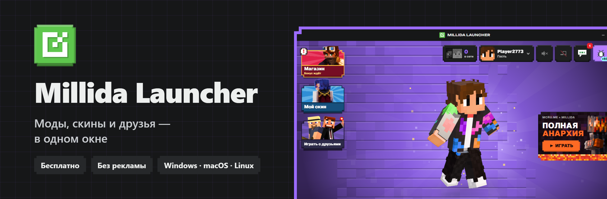
</p>

<p align="center">
  <a href="https://millida.net/launcher/dl/windows"></a>
  <a href="https://millida.net/launcher/dl/macos">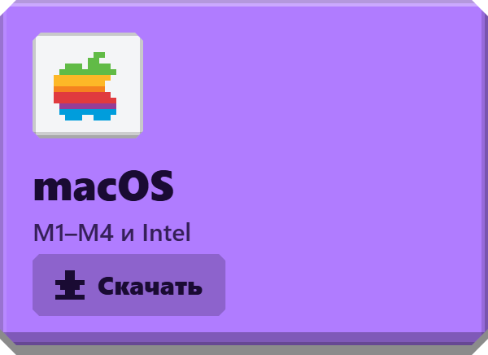</a>
  <a href="https://millida.net/launcher/dl/linux"></a>
</p>

<p align="center">
  <a href="https://github.com/millida/launcher/releases/latest"></a>
  <a href="https://millida.net/launcher/antivirus"></a>
  <a href="LICENSE"></a>
</p>

<p align="center">
  <a href="https://millida.net/launcher/antivirus">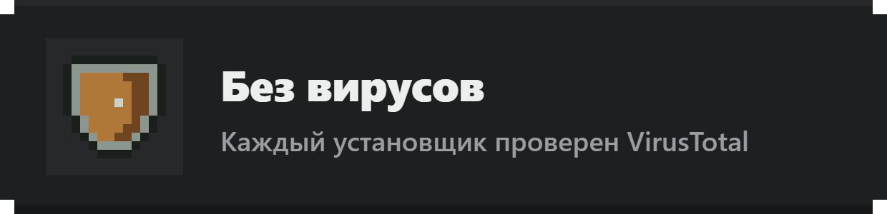</a>
  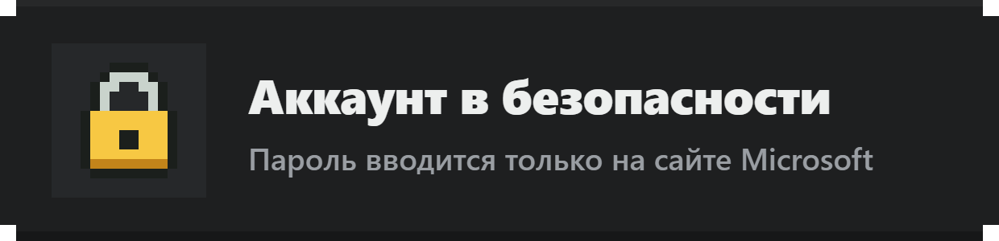
  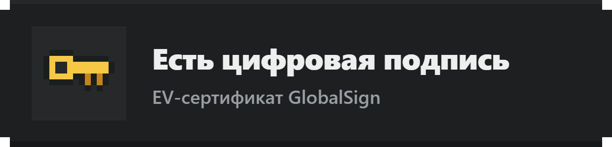
  <a href="ARCHITECTURE.md">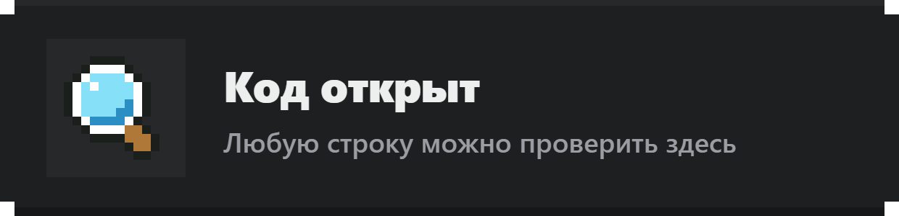</a>
</p>

<p align="center">
  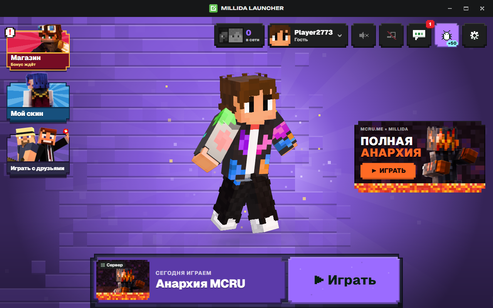
</p>

| Сборки | Каталог |
| :---: | :---: |
| 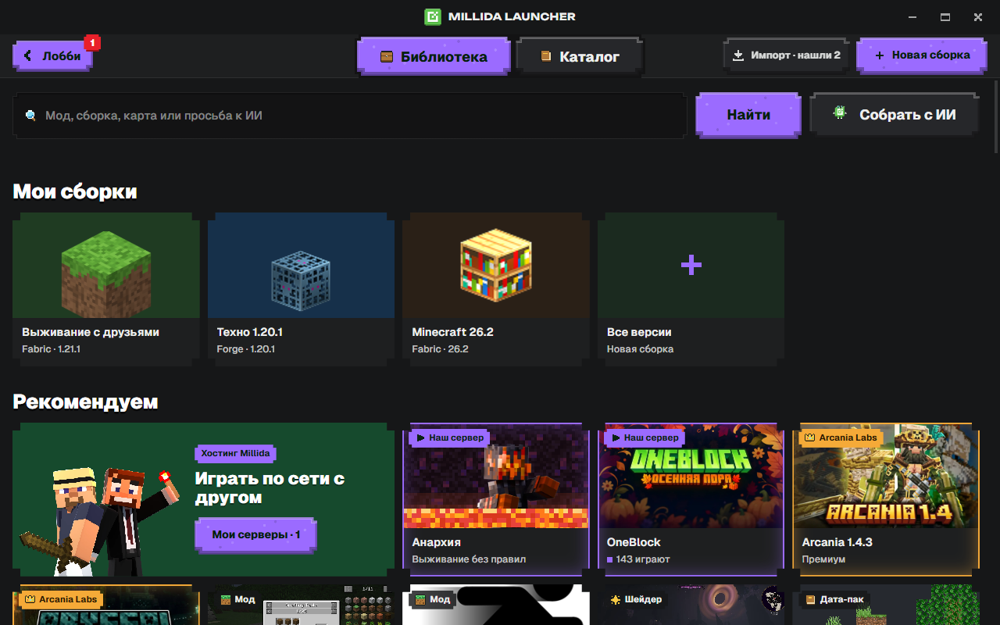 | 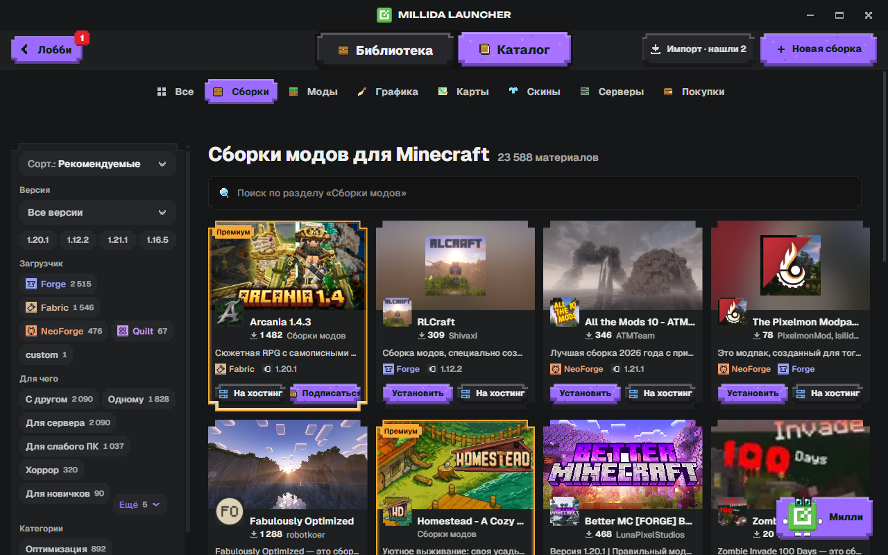 |
| **Гардероб** | **Свой сервер** |
| 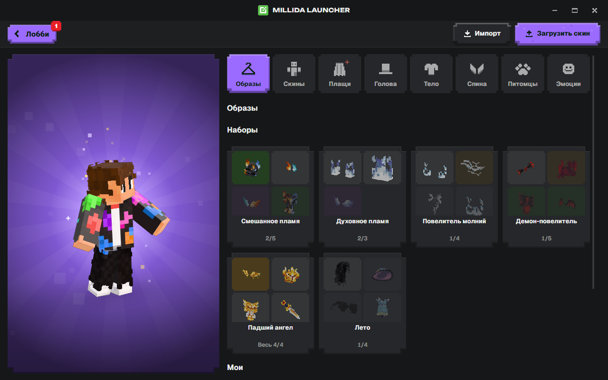 | 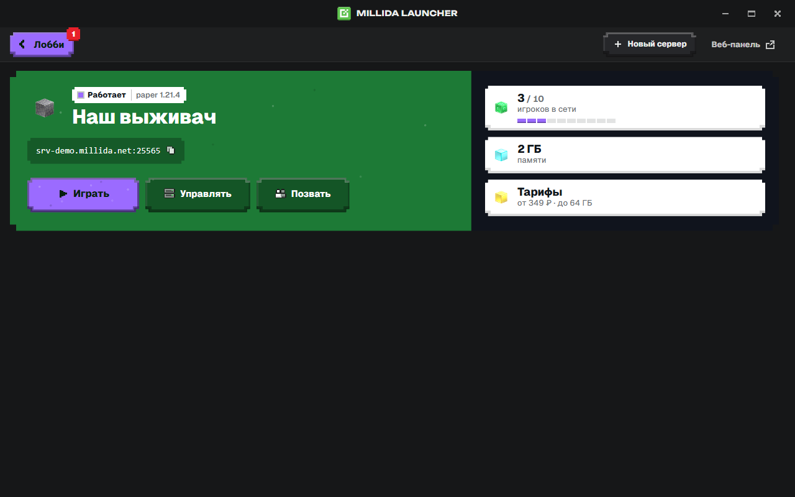 |

## Установка

<details>
<summary><b>Windows</b> — установщик <code>.exe</code></summary>

1. Скачай и запусти установщик — лаунчер откроется сам.
2. Если появилось синее окно «Windows защитила ваш компьютер»: **«Подробнее»** → **«Выполнить в любом случае»**.

Обновления лаунчер ставит сам.
</details>

<details>
<summary><b>macOS</b> — образ <code>.dmg</code> или одна команда</summary>

Перетащи **Millida Launcher** в «Программы». Пишет «повреждено» — выполни в Терминале:

```bash
chmod -R u+w "/Applications/Millida Launcher.app" && xattr -cr "/Applications/Millida Launcher.app"
```

Или поставь одной командой, без этого шага:

```bash
curl -fsSL https://launcher-storage.millida.net/setup/install.sh | sh
```
</details>

<details>
<summary><b>Linux</b> — Flatpak или одна команда</summary>

```bash
flatpak install --user https://launcher-flatpak.millida.net/millida-launcher.flatpakref
```

Без Flatpak (AppImage с ярлыком в меню):

```bash
curl -fsSL https://launcher-storage.millida.net/setup/install.sh | sh
```

`.deb` и `.rpm` — на [странице загрузки](https://millida.net/launcher#download).
</details>

## Вопросы

<details>
<summary><b>Это бесплатно?</b></summary>

Да. Без рекламы и постороннего софта в установщике.
</details>

<details>
<summary><b>Нужен купленный Minecraft?</b></summary>

Нет: можно играть по нику. С лицензией — вход через официальное окно Microsoft, пароль лаунчер не видит.
</details>

<details>
<summary><b>Java ставить нужно?</b></summary>

Нет, лаунчер скачает подходящую сам.
</details>

<details>
<summary><b>Антивирус ругается</b></summary>

Отчёт VirusTotal по каждому установщику — на [millida.net/launcher/antivirus](https://millida.net/launcher/antivirus). Качай только с millida.net или со страницы [релизов](https://github.com/millida/launcher/releases) — всё остальное не наше.
</details>

<details>
<summary><b>Что-то не работает</b></summary>

Напиши в [Discord](https://discord.gg/mcru) или заведи issue. К отчёту приложи `logs/launcher-latest.log` из папки сборки.
</details>

<details>
<summary><b>Как удалить?</b></summary>

Windows — «Параметры» → «Приложения»; macOS — в корзину; Flatpak — `flatpak uninstall net.millida.launcher`.
</details>

## Разработчикам

Rust-ядро (Tauri 2) и интерфейс на React, лицензия [GPL-3.0-only](LICENSE).

[Устройство](ARCHITECTURE.md) · [Как прислать правку](CONTRIBUTING.md) · [Уязвимости](SECURITY.md) · [Название и логотип](TRADEMARK.md)

<details>
<summary><b>Зачем открыт код</b></summary>

Лаунчер держит вход в аккаунт Microsoft, файлы игры и сетевые запросы — честный ответ на вопрос «что он делает с моим аккаунтом» — дать прочитать код целиком. С января по июнь 2026 года поддельные клиенты Minecraft [заразили больше ста тысяч машин](https://thehackernews.com/2026/08/weedhack-malware-spreads-via-fake.html) и крали именно токен входа Microsoft.

- Официальные сборки — только с [millida.net/launcher](https://millida.net/launcher) и из [релизов](https://github.com/millida/launcher/releases) этого репозитория.
- Сторонние сборки мы не поддерживаем. Собрать код для себя это не мешает.
- Правки принимаем сюда — так они достаются всем игрокам сразу.
- GPL-3.0 даёт право на форк, но бренд, ключи и наши сервисы под неё не подпадают — см. [TRADEMARK.md](TRADEMARK.md).

Форку нужны своё имя, свои иконки и своя регистрация приложения в Azure (`MILLIDA_MS_CLIENT_ID`). Установка игры, загрузчики, Java и Modrinth работают без наших серверов; вход Millida, друзья, скины, рейтинг, панель хостинга и прокси к CurseForge ходят в `api.millida.net`.
</details>

<sub>Millida Launcher не связан с Mojang AB и Microsoft. Minecraft — товарный знак Mojang AB.</sub>
